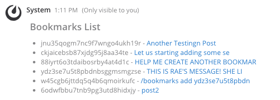

# Mattermost Bookmarks Plugin

<!--  -->

The bookmarks plugin provides advanced options for users to bookmark posts in [Mattermost](https://mattermost.com).

Mattermost allows to users flag a post (similar to bookmarking), but you cannot arrange, group, sort, or view a condensed list of the flags. The bookmarks plugin utilizes a labeling method for bookmarking posts.  A single post can have multiple labels attached to it.

## Slash Commands

### Currently Implemented

* `/bookmarks add <post_id | post_permalink>` - bookmark a post by providing post_id or the post permalink
* `/bookmarks view` - view all bookmarks
* `/bookmarks remove <post_id>` - remove a bookmark from your bookmarks

### ScreenShots

### Future Implementations

* `/bookmarks add <post_id | post_permalink> <title> <labels>` - bookmark a post with optional labels. 
    * if labels omitted, `unlabeled` autoadded
    * provide optional title (currently , title created from first 30
        characters of post)
* `/bookmarks label <post_id> <labels>` - add labels to a bookmark
    * if labels omitted, unlabeled autoadded
* `/bookmarks label add <labels>` - create a new label
* `/bookmarks label list` - list all labels (include number of bookmarks per label)
* `/bookmarks view <label>` - view bookmarks with optional labels for filtering
* `/bookmarks remove label <label>` - remove label from all bookmarks
* `/bookmarks rename <label-old> <label-new>`- rename a label

## UI Enhancements

The following UI Enhancements are planned for future release.

* post action menu
*   * `bookmark/add` (submenu) - same action as /edit but when post_id has not not been bookmarked
    * `bookmark/labels` (submenu) - shows submenus to quickly add / remove labels from current post
    * `bookmark/edit` (submenu) - open modal showing previously saved bookmark
*   * `quickmark` - quickly bookmark the current post without labels (similar to Mattermost flag option)

### Future Implementations

To learn more about plugins, see [Mattermost plugin documentation](https://developers.mattermost.com/extend/plugins/).
