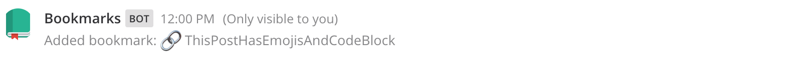
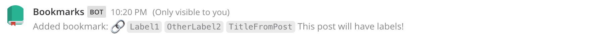
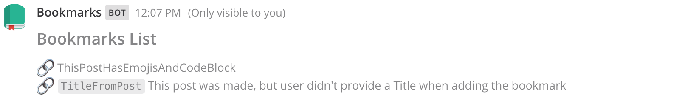
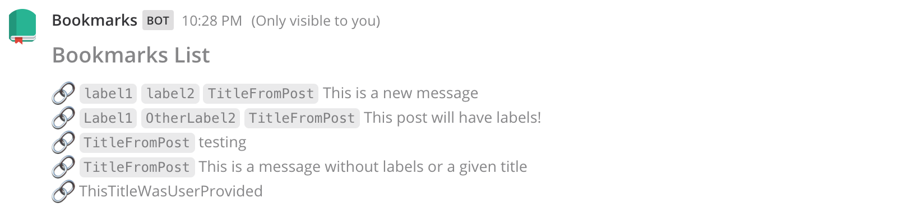
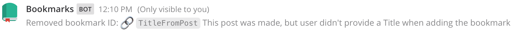
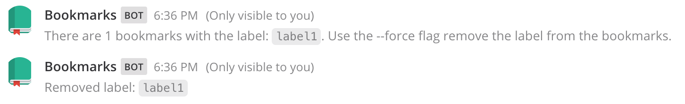

# Mattermost Bookmarks Plugin

[](https://circleci.com/gh/jfrerich/mattermost-plugin-bookmarks)
[](https://goreportcard.com/report/github.com/jfrerich/mattermost-plugin-bookmarks)
[](https://codecov.io/gh/jfrerich/mattermost-plugin-bookmarks)
[](https://github.com/jfrerich/mattermost-plugin-bookmarks/issues)

The bookmarks plugin provides advanced options for users to bookmark posts in [Mattermost](https://mattermost.com).

Mattermost allows users to flag a post (similar to bookmarking), but you cannot arrange, group, sort, or view a condensed list of the flags. The bookmarks plugin allows for bookmarking posts and adding personalized titles which allows the user to add context to a post message.

Additionally, the plugin adds slash commands which provide methods to add, view, and remove bookmarks. The `bookmarks view` command prints a condensed view of the bookmarks allowing a user to easily scan bookmark titles

## ScreenShots

### Post Dropdown Menu UI

Via the post menu action dropdown, users can add a new bookmark, or edit an
existing bookmark. The modal makes it easy for users to modify a bookmark's
data.

* add a title for the bookmark
* add existing labels
* create new labels


### Channel Header Icon

View bookmarks in an ephemeral post


The legend describes the markdown format shown with each bookmark. Use the channel header icon or `/bookmarks view` to see your
bookmarks


## Slash Commands

### Add a bookmark

Bookmark a post by providing a `post_id` or the post `permalink`. You can also
provide a bookmark title and labels for a bookmark.

```
/bookmarks add <permalink> <bookmark_title> --labels <label1>,<label2>
/bookmarks add <post_id> <bookmark_title> --labels <label1>,<label2>
    - OPTIONAL: <bookmark_title>
        - if user no title is provided, the title will be the first 30 characters
          of the post message
        - titles can have spaces in the text
    - OPTIONAL: --labels
        - if a label name is added that wasn't previously created with the
          `label add` command, the name will be added to the labels table
        - accepts a comma-separated list of labels
        - currently does not support spaces in the label name
```

### View a bookmark

When viewing all bookmarks, the default order of the bookmarks matches the order of the `Post.CreateAt` times

When viewing an individual bookmark, an ephemeral message will be posted that shows all bookmark information including labels, title, and the actually post message

Additional filters and sorting methods are planned for the future

```
/bookmarks view
    - view all saved bookmark titles

/bookmarks view <permalink>
/bookmarks view <post_id>
    - Bookmarks Bot will post an ephemeral message of the bookmark details,
      including the post message contents
```

### Remove a bookmark

Remove a bookmark(s) from your saved bookmarks. A space delimited list of permalinks or postIDs can be used to delete multiple bookmarks

```
/bookmarks remove <permalinks>
/bookmarks remove <post_id>
/bookmarks remove <post_id> <post_id2>
```

### Create a label for your bookmarks

Labels can be applied to bookmarks

**Restrictions:**

- You can create the labels and add them to bookmarks, but cannot filter by labels. This is feature will be added soon
- Label names cannot contain spaces
- You can only create one label at a time

```
/bookmarks label add <label>
```

### View all bookmark labels

To view all of you labels, the following command is provided

```
/bookmarks label view
```

### Rename a label

Label names can be changed using the following slash command

```
/bookmarks label rename <from> <to>
```

### Delete a label

Labels can be deleted with the label remove command. This will remove a label
from the labels database.  If any bookmarks are currently using the label, the
user will be notified before the label is deleted, with a message informing the
them of the --force flag. With the --force flag, the label will be removed from
the list of labels and removed from any bookmarks currently using the label.

```
/bookmarks label remove <label>
/bookmarks label remove <label> --force
```

## ScreenShots (Slash Commands)

### Add a bookmark

`/bookmarks add http://localhost:8065/demoteam/pl/5p4xi5hqmjddzfgggtqafk4iga ThisPostHasEmojisAndCodeBlock`



#### Add a bookmark with labels

`/bookmarks add http://localhost:8065/demoteam/pl/1frnfjxiubrzie68wozecxorxo --labels Label1,OtherLabel2`



### View a bookmark

`/bookmarks view`





`/bookmarks view http://localhost:8065/demoteam/pl/75ga1c6pm7n48en8sshn9bgjhy`


### Remove a bookmark

`/bookmarks remove http://localhost:8065/demoteam/pl/1frnfjxiubrzie68wozecxorxo h79hegdtgtbqxn89co1b1iwu7ho`



### Remove a label

This example shows the reponse when a user attempts to first delete a label
that is being used by 1 bookmark.  The `--force` option is used to force the
deletion.

```
/bookmarks label remove <label>
/bookmarks label remove <label> --force
```



To learn more about plugins, see [Mattermost plugin documentation](https://developers.mattermost.com/extend/plugins/).
